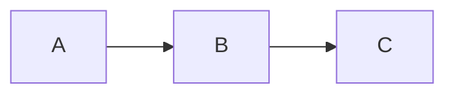

# Agentic Slide Maker: Goal, Scope & Architecture

Based on: [Kiara-Dev-Team/slidev](https://github.com/Kiara-Dev-Team/slidev)

---

## 1. Goal

**Build an AI agent that autonomously creates, edits, and enhances presentation slides from natural language instructions.**

Core value proposition:
- User says "Make a 10-slide deck about X" → Agent produces complete, styled Slidev markdown
- User says "Add a diagram explaining Y to slide 3" → Agent modifies existing deck
- Agent handles content generation, structure, styling, and technical formatting without manual intervention

---

## 2. Scope

### In Scope (MVP)

| Feature | Description |
|---------|-------------|
| **Text-to-slides** | Generate complete slide deck from topic/outline/document |
| **Content enhancement** | Add diagrams (Mermaid), code blocks, icons, LaTeX |
| **Theme selection** | Auto-recommend theme based on content type |
| **Speaker notes generation** | Create presenter notes with timing estimates |
| **Iterative editing** | Modify existing decks via natural language commands |
| **Export** | PDF, PNG, PPTX via Slidev's existing export |

### In Scope (Phase 2)

| Feature | Description |
|---------|-------------|
| **Voice-to-slides** | Whisper transcription → slide generation |
| **Document ingestion** | Convert articles/docs/PDFs to slides |
| **Live Q&A component** | Embedded AI chat during presentation |
| **Multi-turn refinement** | Conversational editing workflow |

### Out of Scope

- Real-time collaborative editing (multi-user)
- Video generation/editing
- Custom theme creation from scratch
- Presenter hardware integration

---

## 3. Architecture

```
┌─────────────────────────────────────────────────────────────────┐
│                        USER INTERFACE                           │
│  ┌─────────────┐  ┌─────────────┐  ┌─────────────┐              │
│  │   CLI       │  │   Web UI    │  │   API       │              │
│  │ slidev-ai   │  │  (optional) │  │  Endpoint   │              │
│  └──────┬──────┘  └──────┬──────┘  └──────┬──────┘              │
└─────────┼────────────────┼────────────────┼─────────────────────┘
          │                │                │
          └────────────────┼────────────────┘
                           ▼
┌─────────────────────────────────────────────────────────────────┐
│                     AGENT ORCHESTRATOR                          │
│  ┌──────────────────────────────────────────────────────────┐   │
│  │  Planning Layer                                          │   │
│  │  - Parse user intent                                     │   │
│  │  - Decompose into sub-tasks                              │   │
│  │  - Manage multi-step workflows                           │   │
│  └─────────────────────────────────────────────────────────┘   │
│                           │                                     │
│  ┌─────────────┬──────────┼──────────┬─────────────┐           │
│  ▼             ▼          ▼          ▼             ▼           │
│ ┌───────┐ ┌─────────┐ ┌────────┐ ┌────────┐ ┌──────────┐       │
│ │Content│ │Structure│ │Diagram │ │Style   │ │Speaker   │       │
│ │Agent  │ │Agent    │ │Agent   │ │Agent   │ │Notes     │       │
│ │       │ │         │ │        │ │        │ │Agent     │       │
│ └───┬───┘ └────┬────┘ └───┬────┘ └───┬────┘ └────┬─────┘       │
└─────┼──────────┼──────────┼──────────┼───────────┼──────────────┘
      │          │          │          │           │
      └──────────┴──────────┼──────────┴───────────┘
                            ▼
┌─────────────────────────────────────────────────────────────────┐
│                    GENERATION ENGINE                            │
│  ┌──────────────────────────────────────────────────────────┐  │
│  │  LLM Interface (Claude API / OpenAI / local)              │  │
│  │  - Prompt templates per task type                         │  │
│  │  - Context management (slide content, theme constraints)  │  │
│  │  - Output validation & retry logic                        │  │
│  └──────────────────────────────────────────────────────────┘  │
└─────────────────────────────────────────────────────────────────┘
                            │
                            ▼
┌─────────────────────────────────────────────────────────────────┐
│                    SLIDEV INTEGRATION                           │
│  ┌─────────────┐  ┌─────────────┐  ┌─────────────────────────┐ │
│  │ Markdown    │  │ Theme       │  │ Validator               │ │
│  │ Generator   │  │ Manager     │  │ - Syntax check          │ │
│  │ - Frontmatter│  │ - List themes│  │ - Mermaid validation    │ │
│  │ - Slide syntax│ │ - Apply theme│  │ - LaTeX validation      │ │
│  │ - Code blocks│ │ - CSS vars  │  │ - Preview render test   │ │
│  └──────┬──────┘  └──────┬──────┘  └───────────┬─────────────┘ │
│         │                │                      │               │
│         └────────────────┼──────────────────────┘               │
│                          ▼                                      │
│  ┌──────────────────────────────────────────────────────────┐  │
│  │  Slidev Core (existing)                                   │  │
│  │  - Dev server (Vite)                                      │  │
│  │  - Export (PDF/PNG/PPTX)                                  │  │
│  │  - Presenter mode                                         │  │
│  └──────────────────────────────────────────────────────────┘  │
└─────────────────────────────────────────────────────────────────┘
                            │
                            ▼
┌─────────────────────────────────────────────────────────────────┐
│                        OUTPUT                                   │
│  slides.md  │  PDF  │  PNG sequence  │  PPTX  │  Live preview   │
└─────────────────────────────────────────────────────────────────┘
```

---

## 4. Key Components

### 4.1 Agent Orchestrator

**Responsibility**: Parse intent, plan execution, coordinate sub-agents

```typescript
interface AgentOrchestrator {
  parseIntent(input: string): Task[];
  execute(tasks: Task[]): SlideOutput;
  handleFeedback(feedback: string, current: SlideOutput): SlideOutput;
}

type Task = 
  | { type: 'generate_outline'; topic: string; slideCount: number }
  | { type: 'generate_content'; outline: Outline }
  | { type: 'add_diagram'; slideIndex: number; concept: string }
  | { type: 'apply_theme'; themeName: string }
  | { type: 'generate_notes'; slides: Slide[] }
  | { type: 'edit_slide'; slideIndex: number; instruction: string };
```

### 4.2 Sub-Agents

| Agent | Input | Output |
|-------|-------|--------|
| **Content Agent** | Topic/document + slide count | Text content per slide |
| **Structure Agent** | Raw content | Slide divisions, headings, hierarchy |
| **Diagram Agent** | Concept description | Mermaid/PlantUML code |
| **Style Agent** | Content analysis | Theme recommendation + CSS overrides |
| **Notes Agent** | Final slides | Speaker notes with timing |

### 4.3 Generation Engine

```typescript
interface GenerationEngine {
  generate(prompt: string, schema?: JSONSchema): string;
  validate(output: string, type: 'markdown' | 'mermaid' | 'latex'): ValidationResult;
  retry(prompt: string, error: ValidationError, maxRetries?: number): string;
}
```

**Prompt template structure**:
```
SYSTEM: You are a presentation expert. Generate Slidev markdown.
CONTEXT: Theme={theme}, existing slides={slides}
CONSTRAINTS: {slidev_syntax_rules}
TASK: {user_instruction}
OUTPUT FORMAT: {json_schema or raw_markdown}
```

### 4.4 Slidev Integration

**Markdown generator output format**:
```markdown
---
theme: seriph
background: https://example.com/bg.jpg
title: Generated Presentation
---

# Slide 1 Title

Content here

---

# Slide 2 Title


```

---

## 5. Data Flow

```
User Input
    │
    ▼
┌─────────────────┐
│ Intent Parser   │ → Structured task list
└────────┬────────┘
         │
         ▼
┌─────────────────┐
│ Task Planner    │ → Ordered sub-agent calls
└────────┬────────┘
         │
    ┌────┴────┬────────┬────────┐
    ▼         ▼        ▼        ▼
 Content   Structure  Diagram  Style
  Agent     Agent     Agent    Agent
    │         │        │        │
    └────┬────┴────────┴────────┘
         │
         ▼
┌─────────────────┐
│ Markdown        │ → Valid Slidev .md
│ Assembler       │
└────────┬────────┘
         │
         ▼
┌─────────────────┐
│ Validator       │ → Pass/Fail + errors
└────────┬────────┘
         │
    ┌────┴────┐
    │         │
  Pass      Fail
    │         │
    ▼         ▼
 Output    Retry with
           error context
```

---

## 6. CLI Interface Design

```bash
# Generate from topic
npx slidev-ai generate --topic "Introduction to Kubernetes" --slides 10

# Generate from document
npx slidev-ai generate --input article.md --slides 8

# Add diagram to existing deck
npx slidev-ai enhance --input slides.md --add-diagram 3 "deployment pipeline"

# Generate speaker notes
npx slidev-ai notes --input slides.md --timing --qa-prep

# Suggest theme
npx slidev-ai theme --input slides.md --suggest

# Voice input (Phase 2)
npx slidev-ai voice --output my-talk.md
```

---

## 7. Technical Dependencies

| Component | Technology | Rationale |
|-----------|------------|-----------|
| LLM | Claude API (primary), OpenAI fallback | Best for structured generation |
| Speech-to-text | Whisper API | Industry standard accuracy |
| Diagram validation | mermaid-cli | Official Mermaid renderer |
| Markdown parsing | remark/unified | Slidev's existing toolchain |
| CLI framework | Commander.js | Already used in Slidev |
| Runtime | Node.js ≥18 | Slidev requirement |

---

## 8. Success Criteria

| Metric | Target |
|--------|--------|
| Generation accuracy | 90%+ slides require no manual editing |
| Mermaid success rate | 95%+ diagrams render correctly |
| Theme appropriateness | 80%+ user agreement with suggestions |
| Time to deck | <30s for 10-slide deck |
| Edit accuracy | 85%+ edits match user intent |

---

## 9. Implementation Phases

**Phase 1 (4 weeks)**: Core generation
- Intent parser + orchestrator
- Content + structure agents
- Markdown generator + validator
- Basic CLI

**Phase 2 (3 weeks)**: Enhancement agents
- Diagram agent (Mermaid)
- Style agent + theme suggestions
- Speaker notes agent

**Phase 3 (3 weeks)**: Advanced features
- Voice input pipeline
- Document ingestion
- Multi-turn editing
- Web UI (optional)
